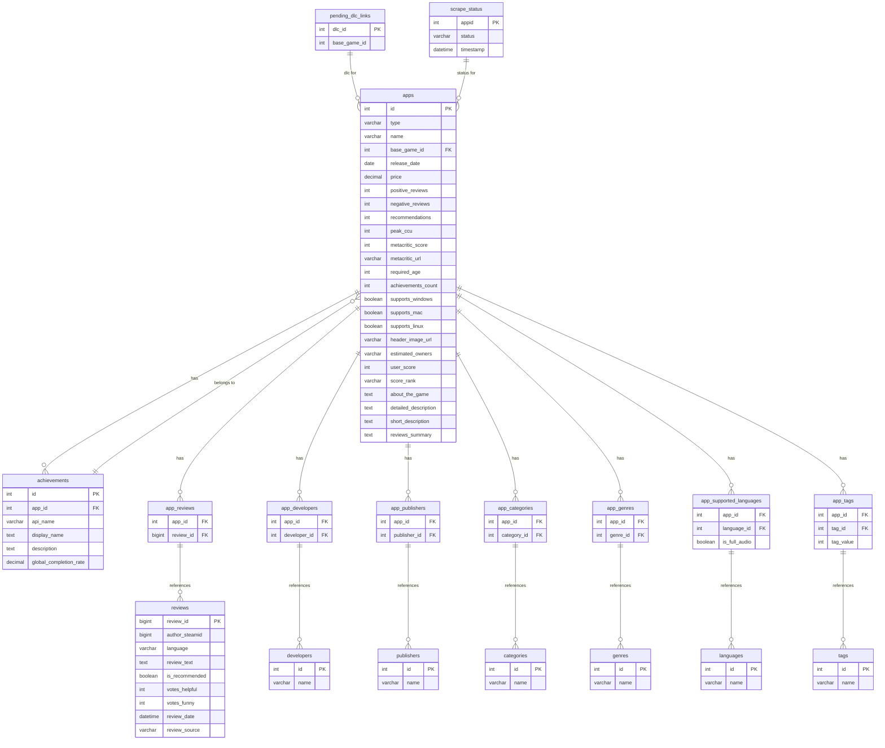

# Steam Game Recommendation System


A personalized game recommendation system for Steam users. This project leverages user data to suggest new games that a user might enjoy. This is an ongoing personal project.

## Table of Contents

- [About The Project](#about-the-project)
  - [Built With](#built-with)
- [Architecture](#architecture)
- [Getting Started](#getting-started)
  - [Prerequisites](#prerequisites)
  - [Installation](#installation)
- [Database](#database)
- [Future Work](#future-work)
- [License](#license)
- [Contact](#contact)

## About The Project

This project aims to provide Steam users with personalized game recommendations based on their gaming history and preferences. With thousands of games available on Steam

### Built With

This project is built with the following technologies:

* [Python](https://www.python.org/) (Pandas, beautifulsoup4)
* [Flask](https://flask.palletsprojects.com/en/2.0.x/)
* [JavaScript](https://developer.mozilla.org/en-US/docs/Web/JavaScript) (Frontend)
* [AWS RDS](https://aws.amazon.com/rds/) (for the database)
* [Oracle Compute Instance](https://www.oracle.com/in/cloud/compute/) (for hosting the server)

## Architecture

The system follows a simple architecture:

1.  **Data Collection & Preprocessing (Python Script):** A Python script is responsible for fetching, cleaning, and preprocessing the Steam user data.
2.  **Database (AWS RDS):** The processed data is stored in a relational database hosted on AWS RDS. This allows for efficient querying and management of the data.
3.  **Recommendation Engine (Python on Oracle Compute):** The core recommendation logic is implemented in Python and runs on an Oracle Cloud Compute instance. This engine can use various recommendation algorithms (e.g., collaborative filtering, content-based filtering) to generate recommendations.
4.  **API Server (Python on Oracle Compute):** A web server (built with Flask) exposes API endpoints that allow users or a front-end application to request recommendations.
5.  **Frontend (JavaScript):** The user interface is built using JavaScript and communicates with the Flask API server to display recommendations.

## Getting Started

To get a local copy up and running, follow these simple steps.

### Prerequisites

Make sure you have the following installed:

* Python 3.8+
* pip

### Installation

1.  **Clone the repo**
    ```sh
    git clone "https://github.com/vaishnn/steam-game-recommendations.git"
    ```
2.  **Install Python packages**
    ```sh
    pip install -r requirements.txt
    ```
3.  **Set up environment variables**

    Create a `.env` file in the root directory and add your AWS and database credentials:
    ```
    AWS_ACCESS_KEY_ID='YOUR_AWS_ACCESS_KEY'
    AWS_SECRET_ACCESS_KEY='YOUR_AWS_SECRET_KEY'
    DB_HOST='YOUR_RDS_ENDPOINT'
    DB_USER='YOUR_DB_USER'
    DB_PASSWORD='YOUR_DB_PASSWORD'
    DB_NAME='YOUR_DB_NAME'
    ```

## Usage

1.  **Run the data processing script:**
    ```sh
    python scraper.py
    ```
**Example API Endpoint:**

* `GET /recommendations?user_id=<steam_user_id>`

    Returns a JSON list of recommended game IDs for the given user.

## Database

The database is hosted on AWS RDS and uses a PostgreSQL (or your chosen) engine. The schema is designed to store user and game information efficiently.

**Key Tables:**



## Future Work

This is an ongoing project, and here are some of the planned features and improvements:

* [ ] Implementing and checking the concept of recommendation algorithms
* [ ] adding more sources of data (Scrapping) like howlongtobeat, steamcharts etc.

## License

Distributed under the MIT License.

## Contact

Your Name - [@your_twitter](https://twitter.com/your_twitter) - your.email@example.com

Project Link:
<p color:"blue">Will be available soon</p>
